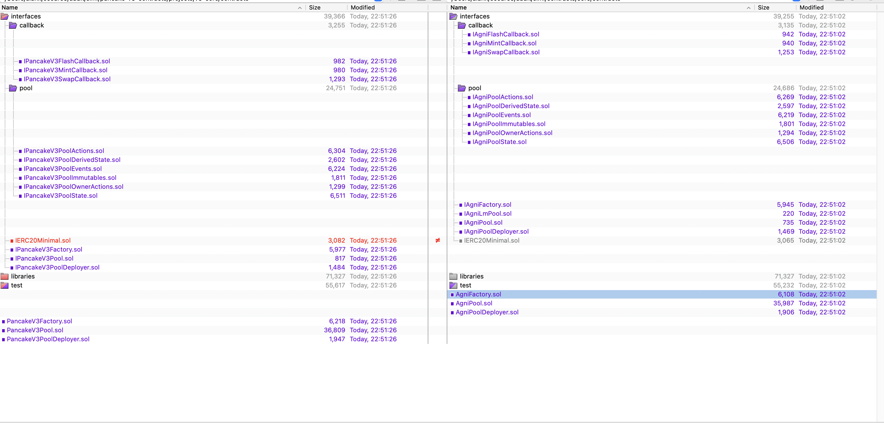

# AgniFinance_PancakeV3_Similarity_Analysis

## Purpose
The primary objective of this analysis is to assess the code similarity between the **[source](#source)** and the **[target](#target)**. 

Our engineering team has embarked on a detailed direct comparison of the code repositories. This examination aims to accurately quantify and understand the extent of similarity.

Our analysis result can be found in the **[conclusion](#conclusion)**.

## Code Repos

#### Source
* https://github.com/agni-protocol/contracts/
    * commit hash: `f29e50d8a591b1cb8e51bb89cd8a82014936b93a`

#### Target
* https://github.com/pancakeswap/pancake-v3-contracts
    * commit hash: `469d62037e005d7d0ed919b97b2c3476c65d41a3`

A copy of the code has also been cloned into [source_code/](source_code/) and [target_code/](target_code/) for reference.

## Conclusion
Based on our similarity analysis, we have the following conclusions:
- the implementation logic of the agni-protocol's contract is highly similar to the core and periphery code of pancake-v3. 
- Agni Finance's `core` and `periphery` contract architecture and interface design follows the pancake-v3's original design. 
- Apart from some variable naming and formatting adjustments, the core functional code does not have substantive differences from pancake-v3. This means the agni-protocol's contract inherits the extensively verified code quality and security of pancake-v3

The agni-protocol team and reader should evaluate whether to directly trust the existing security audits of pancake-v3, based on security requirements and justification.

## Comparison Methodology
1. This analysis draws the above conclusions by comparing the codebase of the two projects at the specified commit hash, with a focus on the `core` and `periphery` contracts.
2. The comparison tool [Beyond Compare](https://www.scootersoftware.com/) has been used to compare the files of the two repositories. Readers can reproduce the comparison using the code repository information provided to reach consistent conclusions.

## Details

#### Contracts comparison between v3-core and agni-contracts/core
- The majority of the changes are **renaming**
- The `IAgniLmPool.sol` is a new interface file added (no implementation) in `agni-contracts/core`

#### Contracts comparison between v3-periphery and agni-contracts/periphery 
Identical with only name and comments changes

- In some the contract files, the license information from // SPDX-License-Identifier: GPL-2.0-or-later to // SPDX-License-Identifier: MIT. This does not have any functional change in the contract.

For the `PoolAddress.sol` contract:
- The difference is the `POOL_INIT_CODE_HASH` address besides a comment wording difference.

These 5 contracts have been deleted in the agni-contracts/periphery repository:

